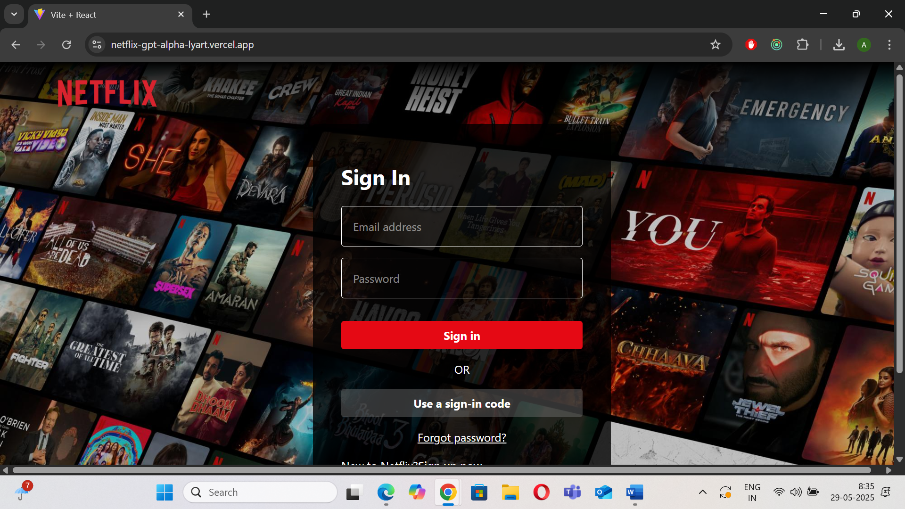
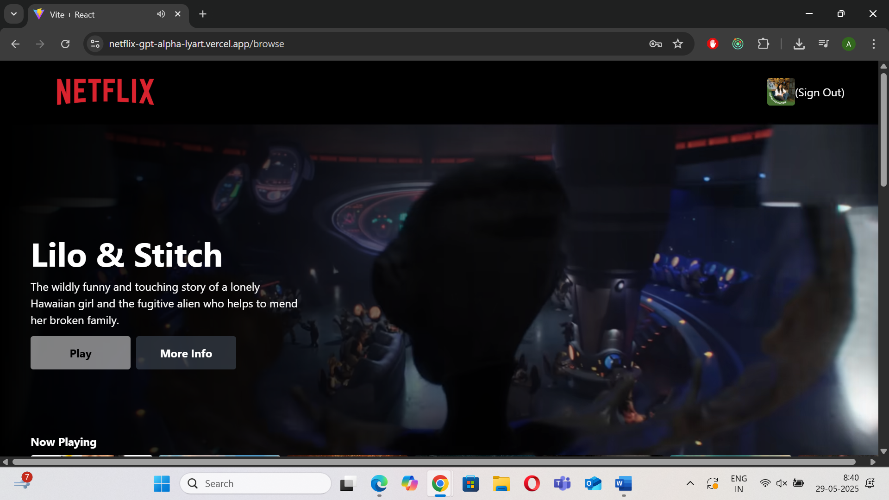
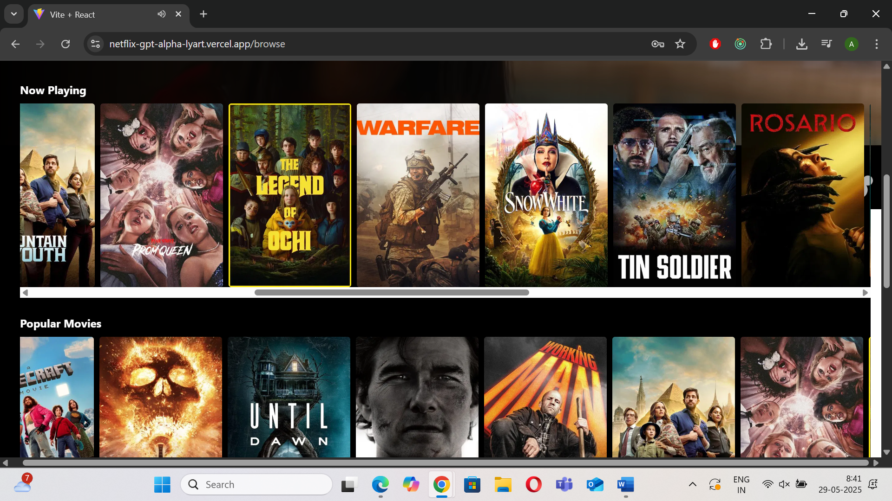

# NetflixGPT
    A full-featured Netflix UI clone built with **React** and **Tailwind CSS**, powered by dynamic data from the **TMDB API**. Includes **user authentication via Firebase**, **global state management with Redux**, route protection, and form validation.

## 🔗 Live Demo

[Click here to view the live demo](https://netflix-gpt-alpha-lyart.vercel.app)

## 📸 Screenshots

 

## 🚀 Features

- 🔐 **Authentication** – Sign-in / Sign-out with Firebase Auth
- 🧪 **Form Validations & Error Handling** – Clean UX for login/signup
- 🎞️ **Dynamic Movie Data** – Fetched from [TMDB API](https://www.themoviedb.org/documentation/api)
- 🎬 **Home Page with Movie Trailer** – Autoplay background trailer with overlay info (title + description) like Netflix
- 🧠 **Redux Store Integration** – Global state management for user auth, movie data, and app-level state
- 🎯 **Protected Routes** – Only authenticated users can access the homepage
- 🧭 **Routing** – Managed with `react-router-dom`
- 💅 **Responsive UI** – Styled using TailwindCSS to mimic Netflix look and feel

---

## 🛠️ Tech Stack

- **React**
- **Redux / Redux Toolkit**
- **Tailwind CSS**
- **Firebase Auth**
- **React Router DOM**
- **TMDB API**

---
# App Layout design(planning)
- Login/sign up page
    - sign in/ sign up page(add form validations)
    - add user to firebase and add authentication logic
    - redierct to browse page (if not authenticated)  
- Browse (after authentication)
    - Header
    - Movies
        - movie trailer in background
        - title & description
        - moviesSuggestion
            - MovieRow *N
- NEtflix GPT
    - Search Bar
    - Movie Suggestions

# Netflix-gpt todo checklist
- Create react app with vite build tool
- Configured tailwind in the project
- Routing
- Header
- Login form
- Sign up form
- Form validation (useRef hook)
- Firebase setup
- Deploying our app to production
- Create sign up user account in firebase
- Implement sign in user api
- Authentication
- Add Redux Store with userSlice
- Implemented Sign Out
- Update user profile api
- Bug fix: update user name, photo on sign up
- Bug fix: fix if user is not signed in redirect /browse to login page and vice-versa
- Unsubscribe to onAuthStateChanged callback
- move hardcoded values to constants file
- Register app and create TMDB account and get api key
- Get data(movies) from TMDB now playing list
- Create moviesSlice in redux store and add nowPlaying movies data into redux store
- Abstract logic for fetching movies and updating store in custom hook
- Planning for main Container and secondary container
- Fetch data for trailer video
- Update store data with trailer data and abstract the logic in a custom hook
- Embed the youtube video and make to autoplay
- Style MainContainer to look awesome
- Create movie list having latest movies from TMDB api's
- Add movie cards with movie posters
- Style Secondary container

